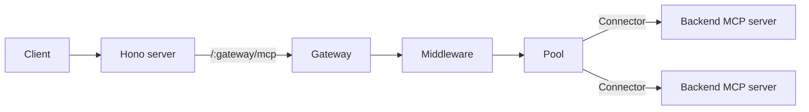

# agent-smith

[](https://github.com/lorenzh/agent-smith/actions/workflows/ci.yml)
[](./LICENSE)
[](https://bun.com)

**Every MCP server you meet, behind one face.**

An MCP gateway: one MCP server that aggregates many downstream MCP servers behind a single
endpoint. It namespaces and routes tools, resources, and prompts, runs them through a
middleware chain, and lets you add or remove gateways and backends at runtime without a
restart.

Named after the agent in The Matrix who assimilates other programs and speaks for all of
them at once. This one does the same to your MCP servers: many backends, one endpoint.

> Status: early and pre-release. The design in [`docs/SPEC.md`](./docs/SPEC.md) is the
> source of truth; much of the protocol layer is still stubbed.



<!-- Diagram source: docs/diagrams/architecture.mmd -->

## Layout

This is a Bun workspace.

| Path | Package | Role |
| --- | --- | --- |
| [`packages/mcp-gateway`](./packages/mcp-gateway) | `@agent-smith/mcp-gateway` | Core. Contracts, registry, mutable host. No web framework dep. |
| [`packages/mcp-gateway-middleware-logging`](./packages/mcp-gateway-middleware-logging) | `@agent-smith/mcp-gateway-middleware-logging` | Middleware that logs operations with timing. |
| [`packages/mcp-gateway-backend-child-process`](./packages/mcp-gateway-backend-child-process) | `@agent-smith/mcp-gateway-backend-child-process` | Connector that runs a backend as a child process over stdio. |
| [`apps/server`](./apps/server) | `@agent-smith/server` | Hono app that wires it together and serves over HTTP. |

## Develop

```sh
bun install
bun run dev      # start the server on :3000
bun test         # run all tests
bun run check    # format + lint with biome
```

## Status

Early. The mutable host, connector registry, middleware contract, namespacing, and admin
API work and are covered by tests. The MCP protocol plumbing (SDK transport, fan-out, the
per-session Server facade) is stubbed and marked with `TODO`. Built with [Bun](https://bun.com).

## Contributing

Contributions are welcome. See [`CONTRIBUTING.md`](./CONTRIBUTING.md) for setup and the PR
process, and [`CODE_OF_CONDUCT.md`](./CODE_OF_CONDUCT.md) for community expectations. Start
from [`docs/SPEC.md`](./docs/SPEC.md) to understand the design.

## Security

Please report vulnerabilities privately. See [`SECURITY.md`](./SECURITY.md).

## License

[MIT](./LICENSE) © Lorenz Hilpert
