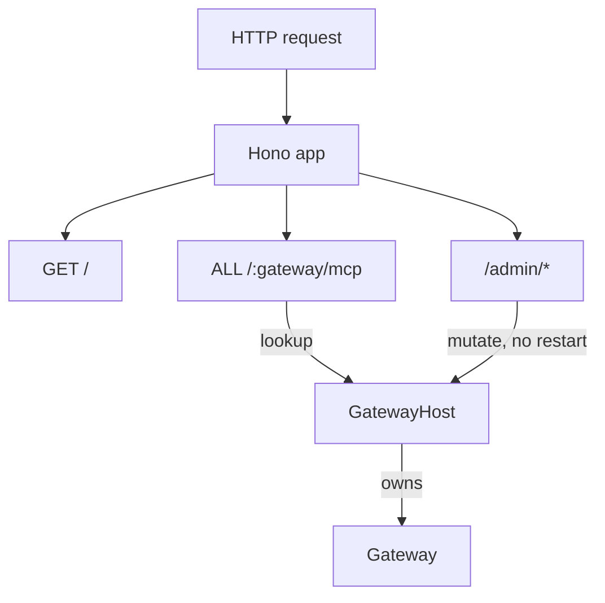

# @agent-smith/server

The agent-smith server: a [Hono](https://hono.dev) app that loads a config, builds a
mutable `GatewayHost`, and exposes every gateway over HTTP. This is where you wire up
which connectors and middleware the deployment supports. Private, not published.



## Run

```sh
bun run dev      # from the repo root, or:
bun run --hot src/index.ts
```

Serves on `http://localhost:3000`.

## Routes

| Method | Path | Description |
| --- | --- | --- |
| `GET` | `/` | Server info and the list of gateway names. |
| `ALL` | `/:gateway/mcp` | The MCP endpoint for one gateway. One dynamic route, so new gateways need no new route. |
| `POST` | `/admin/gateways/:name` | Add a gateway at runtime. |
| `DELETE` | `/admin/gateways/:name` | Remove a gateway. |
| `POST` | `/admin/gateways/:name/backends` | Add a backend to a live gateway. |
| `DELETE` | `/admin/gateways/:name/backends/:alias` | Remove a backend. |

The admin API mutates the live host with no restart. Put it behind your own auth
middleware before exposing it.

## Example

```sh
# add a gateway, then a backend, then hit it - no restart
curl -X POST localhost:3000/admin/gateways/project-c -d '{"backends":{}}'
curl -X POST localhost:3000/admin/gateways/project-c/backends \
  -d '{"alias":"fs","config":{"type":"command","command":"mcp-server-fs"}}'
curl localhost:3000/project-c/mcp
```

## Config

The startup seed lives in [`src/config.ts`](./src/config.ts). It is only a seed; the live
state is whatever the host holds after any admin calls. Swap it for a file or env loader
when you need one.

## Status

Runs. The `/:gateway/mcp` route returns a stub response until the SDK transport is wired
in `honoMcp`. Admin routes and the mutable host are fully working.
