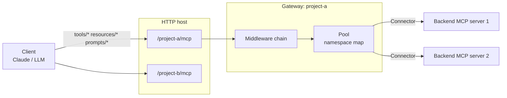
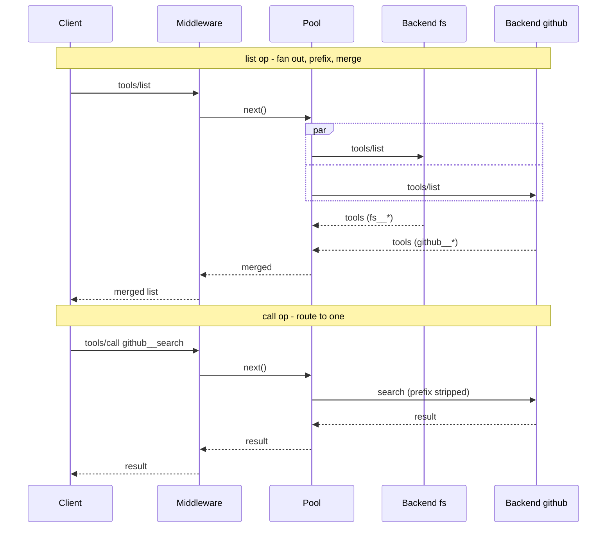

# agent-smith spec

An MCP gateway: one MCP server that aggregates many downstream MCP servers behind a
single endpoint. Inbound `tools/*`, `resources/*`, `prompts/*` are fanned out (for
list ops) or routed to one backend (for call ops), passed through a middleware chain,
and returned merged. Everything is mutable at runtime: gateways, backends, and
middleware can be added or removed without a restart.



## Packages

| Path | npm name | Role |
| --- | --- | --- |
| `packages/mcp-gateway` | `@agent-smith/mcp-gateway` | Core. Gateway, Pool, middleware contract, connector registry. No web framework dep. |
| `packages/mcp-gateway-middleware-logging` | `@agent-smith/mcp-gateway-middleware-logging` | A Middleware that logs every operation with timing. |
| `packages/mcp-gateway-backend-child-process` | `@agent-smith/mcp-gateway-backend-child-process` | A Connector that runs a backend as a raw child process over stdio. |
| `apps/server` | `@agent-smith/server` (private) | Hono app. Loads config, builds a GatewayHost, exposes it over HTTP, offers an admin API. |

Packages are flat under `packages/`, one directory per published package, with the
directory name matching the unscoped npm name. The Hono glue ships as a core subpath
`@agent-smith/mcp-gateway/hono` with `hono` as an optional `peerDependency`, so the core
main entry stays framework-free.

Root `package.json` workspaces:

```json
"workspaces": ["packages/*", "apps/*"]
```

## Core contracts

All types below live in `@agent-smith/mcp-gateway`. `Transport`, `Tool`, `Resource`,
`Prompt`, and result types come from `@modelcontextprotocol/sdk`.

### Connector

A Connector knows how to produce and own a live `Transport` to one backend running in
some isolation model (child process, docker, microvm, remote http). It is the per-package
extension point. One package per isolation model.

```ts
interface BackendConnector {
  readonly alias: string;
  // Called on first connect and on every restart. Slow boots (vm cold start) happen here.
  connect(signal: AbortSignal): Promise<Transport>;
  // Optional isolation-specific teardown beyond closing the transport (kill vm, rm container).
  dispose?(): Promise<void>;
}

type ConnectorFactory = (config: unknown, ctx: ConnectorContext) => BackendConnector;

interface ConnectorContext {
  alias: string;
  logger: Logger;
}

interface ConnectorRegistry {
  register(type: string, factory: ConnectorFactory): void;
  create(type: string, alias: string, config: unknown): BackendConnector;
}
```

Core registers `command` (child process) and `http` (remote) built in. Extra packages
register their own type, for example `docker`, and validate their own config slice.

### Backend

Internal to core. Wraps an SDK `Client` plus a Connector, and owns supervision:
detect `onclose`/`onerror`, back off, call `connector.connect()` again. Restart policy is
uniform and lives here, not in the connector.

```ts
interface Backend {
  readonly alias: string;
  readonly status: "connecting" | "ready" | "down";
  listTools(): Promise<Tool[]>;
  callTool(name: string, args: unknown): Promise<CallToolResult>;
  listResources(): Promise<Resource[]>;
  readResource(uri: string): Promise<ReadResourceResult>;
  listPrompts(): Promise<Prompt[]>;
  getPrompt(name: string, args: unknown): Promise<GetPromptResult>;
  // Fires when the backend reports notifications/*/list_changed.
  onListChanged(cb: () => void): () => void;
  dispose(): Promise<void>;
}
```

### Pool

Internal to core. Holds the live Backends for one Gateway and owns the namespace map.

- Aliases are validated at add time against `^[a-z0-9][a-z0-9-]*$`, so they can never
  contain the separator or break a uri. The operator picks the alias; a backend only
  controls the original name/uri, which always lands after the alias prefix, so a backend
  cannot forge or collide with another backend's namespace.
- Tools and prompts: exposed name = `<alias>__<original>`. Decode splits on the FIRST `__`;
  since the alias has no `__`, this is unambiguous even when the original name itself
  contains `__`.
- Resources: exposed uri = `agent-smith://<alias>/<percent-encoded-original-uri>`. Percent
  encoding collapses the original uri into a single path segment, so it cannot inject extra
  authority or path structure, and the `agent-smith` scheme avoids the scheme-collision the
  old `<alias>+<uri>` form had.
- Routing is by an authoritative `NamespaceIndex` (`exposed -> { alias, original, value }`)
  rebuilt on each aggregation pass, not by re-parsing the string in the hot path. Call ops
  resolve through it; an unknown or stale exposed id returns an error rather than being
  decoded and forwarded blindly. The `encode`/`decode` helpers exist for building and
  echoing identifiers, but `resolve()` is the source of truth for whether a target exists.
- List ops (`tools/list`, `resources/list`, `resources/templates/list`, `prompts/list`):
  query every ready backend, encode each entry, merge. A down backend contributes nothing
  and does not fail the list.
- Call ops (`tools/call`, `resources/read`, `resources/subscribe`, `resources/unsubscribe`,
  `prompts/get`, `completion/complete`): resolve the name/uri/ref through the
  `NamespaceIndex` to its single target backend, forward the original name/uri. Never fan a
  call out. A backend that does not support completions returns empty values rather than an
  error.
- Subscriptions: the Pool tracks which session subscribed to which namespaced uri and
  forwards backend `notifications/resources/updated` up to those sessions, re-prefixing
  the uri.
- The map is rebuilt whenever a backend is added, removed, or fires `list_changed`.
- `ping` is answered locally; `logging/setLevel` broadcasts to every backend.



### Middleware

A Middleware wraps one client-facing operation after the target backend(s) have been
resolved. Middleware never talks to backends directly; the Pool does that inside `next()`.

```ts
type CompletionRef =
  | { type: "ref/prompt"; name: string }        // namespaced
  | { type: "ref/resource"; uri: string };      // namespaced

type GatewayOperation =
  // list ops: fan out, merge
  | { kind: "tools/list" }
  | { kind: "resources/list" }
  | { kind: "resources/templates/list" }
  | { kind: "prompts/list" }
  // call ops: route to one backend
  | { kind: "tools/call"; name: string }
  | { kind: "resources/read"; uri: string }
  | { kind: "resources/subscribe"; uri: string }
  | { kind: "resources/unsubscribe"; uri: string }
  | { kind: "prompts/get"; name: string }
  | { kind: "completion/complete"; ref: CompletionRef };

interface GatewayContext {
  operation: GatewayOperation;
  backends: { alias: string }[];   // one entry for call ops, many for list ops
  request: unknown;                // mutable: rewrite args before next()
  response?: unknown;              // set after next(); mutable on the way out
  meta: Record<string, unknown>;   // scratch (timing, request id, auth principal)
}

type Next = () => Promise<void>;
type Middleware = (ctx: GatewayContext, next: Next) => Promise<void>;
```

Patterns: logging wraps `next()` with a timer. Sanitizing mutates `ctx.request` or
`ctx.response` around `next()`. Access control denies by throwing (call ops) or filters
`ctx.response` after `next()` (list ops); both halves are required, since a client can
call a tool whose name it already knows even if it was hidden from the list.

### Access control

Ships as a middleware. Glob rules over namespaced names, so backend-level rules like
`github__*` work without a separate config path.

```ts
interface AccessRule { allow?: string[]; deny?: string[]; }   // glob patterns
// If allow is set: deny-by-default, only matches pass. deny always subtracts on top.
```

### Gateway (mutable)

A self-contained unit: a Pool plus a middleware chain plus access rules. Long-lived and
shared across client sessions. `createServer()` is the seam the Hono adapter uses: it
returns a fresh per-session MCP `Server` facade wired into this gateway's shared Pool, so
sessions are cheap and downstream processes are not respawned per client.

```ts
interface Gateway {
  readonly name: string;
  createServer(): Server;                                   // per-session facade over shared Pool
  instructions(): string;                                   // merged backend instructions

  addBackend(alias: string, config: BackendConfig): Promise<void>;
  removeBackend(alias: string): Promise<void>;
  backends(): { alias: string; status: string }[];

  use(mw: Middleware): void;                                // append to the chain
  onChange(cb: () => void): () => void;                     // fires on backend add/remove/list_changed
  dispose(): Promise<void>;
}
```

On backend add/remove, the Gateway rebuilds the namespace map and emits
`notifications/tools/list_changed` (and the resources/prompts equivalents) to every live
session, so connected clients re-list and pick up changes without reconnecting.

### Instructions aggregation

A downstream server can return an `instructions` string in its `initialize` result.
The Gateway captures each backend's instructions at connect time and `instructions()`
merges them, labeled by alias so a model can tell which server said what:

```text
## fs
<fs server instructions>

## github
<github server instructions>
```

`createServer()` serves this merged string as the per-session Server's own `instructions`.
There is no `instructions_changed` notification in MCP, so a client only sees instructions
at `initialize`: new sessions pick up the current merge, existing sessions keep what they
got at connect. This is aggregation state, not a per-request operation, so it does not flow
through the middleware chain.

### GatewayHost (mutable)

Owns the set of named gateways. The transport host (Hono app, stdio launcher) is built on
top and stays thin.

```ts
function createGatewayHost(config: HostConfig): Promise<GatewayHost>;

interface GatewayHost {
  names(): string[];
  gateway(name: string): Gateway | undefined;
  addGateway(name: string, config: GatewayConfig): Promise<Gateway>;
  removeGateway(name: string): Promise<void>;               // tears down backends, closes sessions
  dispose(): Promise<void>;
}
```

## Config

```jsonc
{
  "gateways": {
    "project-a": {
      "backends": {
        "fs":  { "type": "command", "command": "mcp-server-fs", "args": ["--root", "."] },
        "gh":  { "type": "http",    "url": "https://example.com/mcp" }
      },
      "middleware": ["@agent-smith/mcp-gateway-middleware-logging"],
      "access": { "tools": { "allow": ["fs__*"] } }
    },
    "project-b": {
      "backends": { "fs": { "type": "command", "command": "mcp-server-fs", "args": [] } }
    }
  }
}
```

`type` selects the connector; it defaults to `command`. Each connector validates its own
config slice (zod). Config is the startup seed only; the live state is whatever the mutable
host holds after admin calls.

## Hono server (apps/server)

A single dynamic dispatch route so new gateways need no new route. Per-gateway handlers
manage their own session map.

```ts
import { Hono } from "hono";
import { createGatewayHost } from "@agent-smith/mcp-gateway";
import { honoMcp } from "@agent-smith/mcp-gateway/hono";

const host = await createGatewayHost(loadConfig());
const app = new Hono();

app.all("/:gateway/mcp", async (c) => {
  const gw = host.gateway(c.req.param("gateway"));
  if (!gw) return c.json({ error: "unknown gateway" }, 404);
  return honoMcp(gw)(c);                 // honoMcp caches one handler + session map per gateway
});

// Admin API (mutates the live host, no restart):
app.post("/admin/gateways/:name",            /* host.addGateway */);
app.delete("/admin/gateways/:name",          /* host.removeGateway */);
app.post("/admin/gateways/:name/backends",   /* gateway.addBackend */);
app.delete("/admin/gateways/:name/backends/:alias", /* gateway.removeBackend */);

export default app;   // Bun serves app.fetch
```

`honoMcp(gateway)` keeps `Map<sessionId, WebStandardStreamableHTTPServerTransport>`. On a
new session it calls `gateway.createServer()`, connects a fresh transport, and stores it.
The SDK transport is fetch-native, so `transport.handleRequest(c.req.raw)` returns a
`Response` directly. The admin routes are unauthenticated in this scaffold and must not be
exposed without an auth layer; the `command` connector spawns local processes, so an open
admin API is remote code execution. See Known gaps for the planned auth and type-gating.

## Known gaps and open decisions

These came out of a three-way design review (protocol correctness, architecture, and
operational edge cases). They are not yet reflected in the contracts above. Ranked by how
much they block a real deployment. Items marked **DECISION** need a product call before
implementing; the rest are "do it this way when wiring the layer."

### Blockers for a working gateway

> Namespace routing (validated aliases, first-separator split, `agent-smith://` resource
> uris, authoritative `NamespaceIndex`) is now implemented in `src/namespace.ts` and folded
> into the Pool section above.

- **No upward capability negotiation.** The gateway must advertise an `initialize`
  capability set that is the union of its backends: `tools`/`resources`/`prompts` if any
  backend has them; `resources.subscribe` and `*.listChanged` as an OR; `completions` and
  `logging` if any backend advertises them. Subscribe must route only to backends that
  declared it. Recompute on backend add/remove; new sessions get the new set (MCP has no
  mid-session renegotiation), existing sessions keep theirs.
- **The connector registry never reaches a Gateway.** `createGatewayHost` takes a registry
  but the `Gateway` interface has no way to turn `{ type: "command" }` into a connector ->
  `Backend`. Thread the `ConnectorRegistry` into the Gateway; `addBackend` resolves
  `config.type` via `registry.create(...)` into a supervised `Backend`, and rejects when the
  type is unregistered.
- **Pagination is dropped on list ops.** `tools/list`, `resources/list`,
  `resources/templates/list`, and `prompts/list` are cursor-paginated. The Pool must drain
  each backend's pages before merging (a composite upstream cursor can come later).

### Security (DECISION needed)

- **Admin API auth and connector-type gating.** The admin API mutates the live host and can
  add a `command` backend that spawns local processes, i.e. unauthenticated RCE if exposed.
  Options: (a) require an authenticator as a hard dependency and deny the `command`
  connector over admin by default; (b) require auth only; (c) leave it to operators. Leaning
  (a). Until decided, the server must not be exposed without an auth layer in front.
- **Treat backend output as hostile.** Validate tool names and URIs from backends; escape or
  reject glob metacharacters before access-control matching; match access rules on the
  structured `{ alias, originalName }`, not the joined string; assert the list-filter and
  call-deny halves share one compiled predicate so they cannot desync.

### Server-to-client surface (DECISION needed)

- **Sampling, elicitation, roots.** Backends can call up to the real client, but many
  sessions share one backend connection, so the gateway must decide whose client answers.
  Options: route request-scoped backend calls to the session that made the in-flight call
  (reject spontaneous ones), or declare these unsupported in v1. Leaning "route to
  originating session." Needs the per-session request-id correlation table either way.
- **Progress, cancellation, backend log messages.** Forward inbound `progressToken` and
  relay backend `notifications/progress` to the originating session; maintain a per-session
  client-reqid <-> backend-reqid table and forward `notifications/cancelled` both ways; relay
  backend `notifications/message` upward, tagged with the alias and filtered by each
  session's log level.

### Lifecycle and concurrency

- **Mid-call removal and replace semantics.** `removeBackend` while a call is in flight:
  stop new routing immediately, abort in-flight with a typed `GatewayError` (rendered as a
  proper JSON-RPC error), drain with a timeout, then `connector.dispose()`. `addBackend` /
  `addGateway` on an existing name must dispose the prior instance (await teardown) instead
  of overwriting and leaking it. Serialize mutations per gateway so concurrent add/remove of
  the same alias are ordered.
- **Gateway removal vs the Hono session map.** `honoMcp` holds its own
  `Map<sessionId, transport>`. `removeGateway` must close those transports and end open
  streams; key the per-gateway handler cache on the gateway instance and evict on removal so
  a remove-then-readd does not reuse a stale session map.
- **Supervision needs bounds.** Exponential backoff with a cap and a max-consecutive-failure
  ceiling that parks the backend in `down` with a reason (no infinite crash loop); a connect
  timeout that fires the `AbortSignal` passed to `connector.connect()`; `addBackend` is
  fire-and-connect (registers and returns immediately, status observable via `onChange`), so
  a slow or broken backend never hangs the admin call.
- **Subscription lifecycle.** When a subscribed backend goes `down` or is removed, drop its
  subscription entries and nudge the subscribed sessions so they can re-subscribe; re-issue
  downstream subscribes on restart for still-connected sessions; tie subscription entries to
  session teardown so they do not leak.
- **Per-session state that is actually shared downstream.** `logging/setLevel` is per-client
  but the backend connection is shared: track each session's level at the gateway, set the
  backend to the most verbose requested level, and filter relayed log records per session.
  Never pass a client's raw request or progress id straight downstream.

### Resource limits (untrusted backends)

- Per-call timeout and a max response-byte ceiling (stream-counted, abort on exceed); a cap
  on tools/resources a single backend may register (truncate and log); a token bucket on
  inbound notifications per backend; debounce/coalesce `list_changed` so a flapping backend
  cannot trigger O(sessions x backends) rebuilds per flap; per-backend and per-session
  in-flight concurrency caps; idle teardown of backends and a max-backends ceiling per host.

### Contract and typing polish

- Parameterize `GatewayContext` by operation (`GatewayContext<Op extends GatewayOperation>`)
  so narrowing on `operation.kind` narrows `request`/`response`, instead of `unknown`.
- `createServer(session: SessionContext)` carrying `{ id, auth?, headers? }`, populated by
  `honoMcp` from `c.req.raw`, so `ctx.meta` actually has the auth principal it advertises.
- `Backend` is missing `subscribe`/`unsubscribe`/`complete`/`setLevel`, plus `capabilities`
  and `instructions`; `onListChanged` should carry which list (tools/resources/prompts)
  changed instead of collapsing all three.
- `use()` should return a disposer so middleware is removable at runtime (the "everything
  mutable" claim currently has no remove path); add a runtime access-rule setter or drop the
  claim for access rules.
- `ConnectorRegistry` is a concrete class, not an interface: align the spec; `register`
  returns `this` and there is a `has()`; guard duplicate `type` registration; consider a
  connector `apiVersion` for the third-party compat story.
- `BackendInfo.status` should use the `"connecting" | "ready" | "down"` union, not `string`.
- Connector config validation needs a real seam (zod in the factory) rather than the current
  `as` cast.

### Intentionally deferred

- Remote backend auth beyond a static token/header (no OAuth flow in v1).
- A `connector.restart?()` hook for isolation that wants warm-pool or snapshot-resume
  instead of cold reconnect. Add only when a backend package needs it.
- Per-backend middleware hooks. For now the Pool writes per-backend timings into `ctx.meta`
  and the single chain sees the merged result.
- stdio host (serves exactly one gateway). HTTP host is the primary target.
