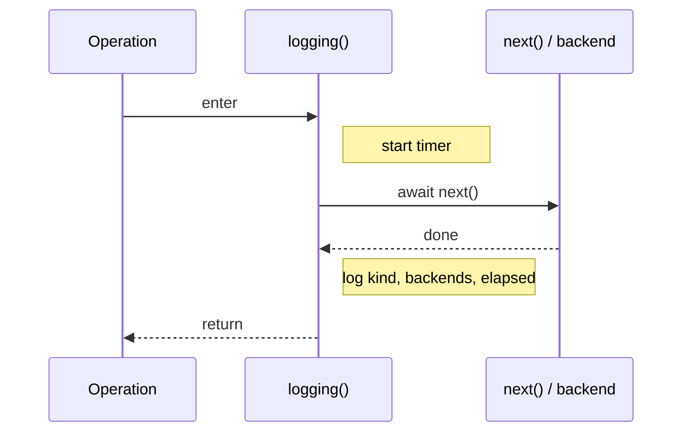

# @agent-smith/mcp-gateway-middleware-logging

A [`@agent-smith/mcp-gateway`](../mcp-gateway) middleware that logs every gateway operation with
timing. Wraps `next()` so it covers both the inbound and outbound side of a call.



<!-- Diagram source: packages/mcp-gateway-middleware-logging/diagrams/logging-sequence.mmd -->

## Install

```sh
bun add @agent-smith/mcp-gateway-middleware-logging
```

## Usage

```ts
import { logging } from "@agent-smith/mcp-gateway-middleware-logging";

gateway.use(logging());

// Custom sink:
gateway.use(logging({ logger: { info: (m) => myLogger.debug(m) } }));
```

Output looks like:

```text
[mcp-gateway] tools/call [github] 42.1ms
[mcp-gateway] tools/list [fs,github] 3.4ms
```

## Status

Works. Logs `operation.kind`, the target backend aliases, and elapsed time.
