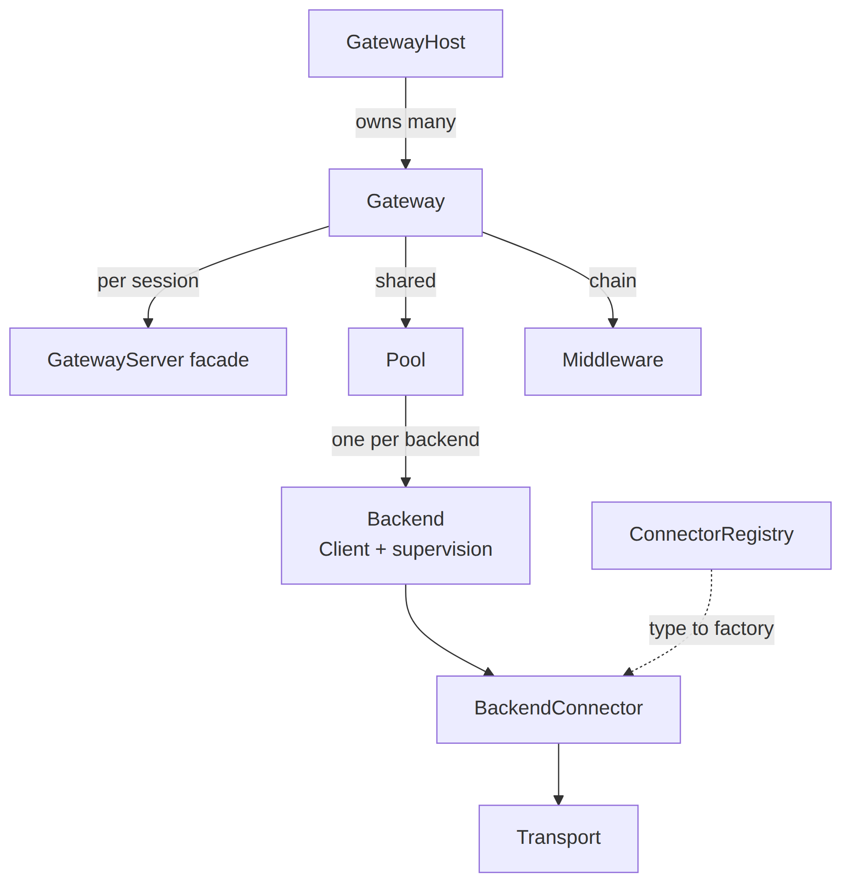

# @agent-smith/mcp-gateway

Core of the agent-smith MCP gateway: one MCP server that aggregates many downstream
MCP servers behind a single endpoint. Framework-agnostic, no web server dependency.

It owns the contracts everything else builds on:

- **Connector** (`BackendConnector`, `ConnectorFactory`, `ConnectorRegistry`) - the
  per-isolation-model extension point. One package per isolation model (child process,
  docker, microvm, ...).
- **Middleware** (`Middleware`, `GatewayContext`, `GatewayOperation`) - wraps each
  client-facing operation after namespace routing.
- **Gateway / GatewayHost** - mutable runtime objects. Gateways and backends can be added
  or removed without a restart.

See [`docs/SPEC.md`](../../docs/SPEC.md) for the full design.



<!-- Diagram source: packages/mcp-gateway/diagrams/components.mmd -->

## Install

```sh
bun add @agent-smith/mcp-gateway
```

## Usage

```ts
import { ConnectorRegistry, createGatewayHost } from "@agent-smith/mcp-gateway";

const registry = new ConnectorRegistry().register("command", myConnector);

const host = await createGatewayHost(
  {
    gateways: {
      "project-a": {
        backends: { fs: { type: "command", command: "mcp-server-fs" } },
      },
    },
  },
  { registry },
);

// Mutate at runtime, no restart:
const gw = host.gateway("project-a")!;
await gw.addBackend("gh", { type: "http", url: "https://example.com/mcp" });
```

To serve a gateway over HTTP, use the fetch-native helper from the `/hono` subpath:

```ts
import { honoMcp } from "@agent-smith/mcp-gateway/hono";
```

## Exports

| Path | Contents |
| --- | --- |
| `@agent-smith/mcp-gateway` | `createGatewayHost`, `ConnectorRegistry`, all contract types |
| `@agent-smith/mcp-gateway/hono` | `honoMcp` - fetch-native handler for one gateway |

## Security

The gateway is **not secured by default**. It has a single purpose, aggregation, and
leaves authentication to the operator. Both surfaces are open unless you put auth in front:

- The data plane (`/:gateway/mcp`) exposes every aggregated backend to any caller.
- The admin API mutates the live host. A `command` backend spawns local processes, so an
  open admin API is remote code execution.

Secure both with HTTP middleware in your server. The gateway core never reads auth headers.
With Hono, use the built-in `bearer-auth` (no extra dependency):

```ts
import { bearerAuth } from "hono/bearer-auth";

// admin API
app.use("/admin/*", bearerAuth({ verifyToken: async (t) => isValidAdminToken(t) }));
// data plane
app.use("/:gateway/mcp", bearerAuth({ verifyToken: async (t) => isValidClientToken(t) }));
```

To pass an auth principal through to access-control middleware, set it on the Hono context
(`c.set("auth", principal)`); `honoMcp` carries it into `ctx.meta.auth` without
interpreting it.

The connector registry is the other security boundary. Core ships the `command` and `http`
connectors but registers nothing by default. Register only the connector types you want
reachable, e.g. don't register `command` if local-process execution is unacceptable.

## Status

Early. The mutable host, registry, namespacing, and contracts are in place and exercised
by tests. The MCP protocol plumbing (SDK transport, Pool, fan-out) is stubbed and marked
with `TODO`. See the spec for what each layer will do.
