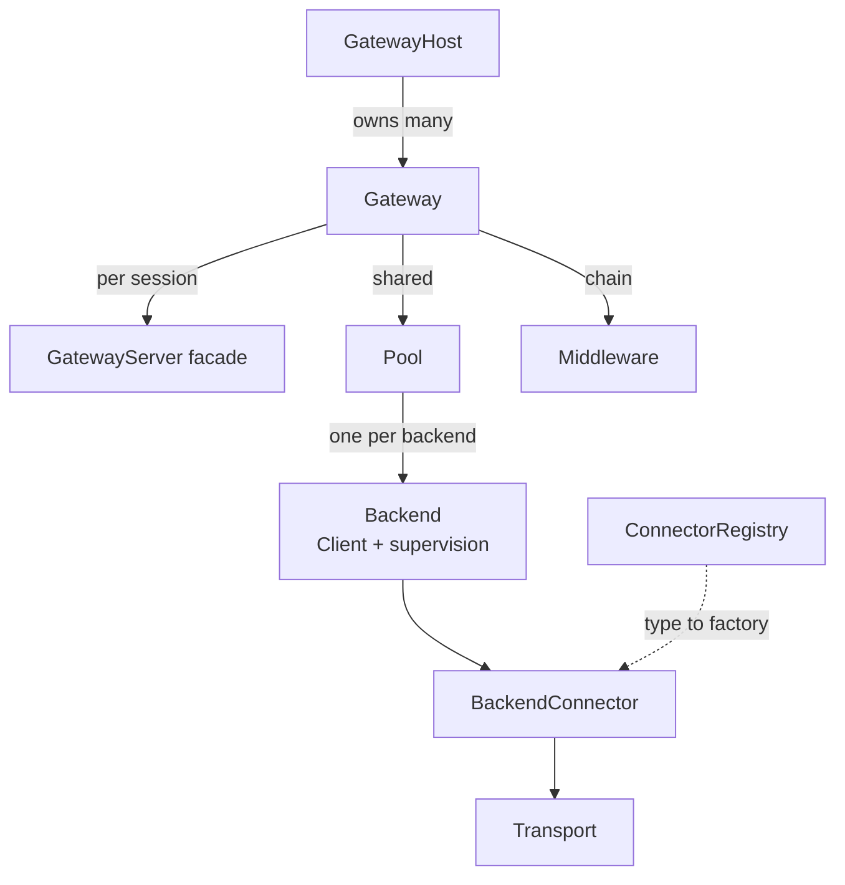

# @agent-smith/mcp-gateway

Core of the agent-smith MCP gateway: one MCP server that aggregates many downstream
MCP servers behind a single endpoint. Framework-agnostic, no web server dependency.

It owns the contracts everything else builds on:

- **Connector** (`BackendConnector`, `ConnectorFactory`, `ConnectorRegistry`) - the
  per-isolation-model extension point. One package per isolation model (child process,
  docker, microvm, ...).
- **Middleware** (`Middleware`, `GatewayContext`, `GatewayOperation`) - wraps each
  client-facing operation after namespace routing.
- **Gateway / GatewayHost** - mutable runtime objects. Gateways and backends can be added
  or removed without a restart.

See [`docs/SPEC.md`](../../docs/SPEC.md) for the full design.



## Install

```sh
bun add @agent-smith/mcp-gateway
```

## Usage

```ts
import { ConnectorRegistry, createGatewayHost } from "@agent-smith/mcp-gateway";

const registry = new ConnectorRegistry().register("command", myConnector);

const host = await createGatewayHost(
  {
    gateways: {
      "project-a": {
        backends: { fs: { type: "command", command: "mcp-server-fs" } },
      },
    },
  },
  { registry },
);

// Mutate at runtime, no restart:
const gw = host.gateway("project-a")!;
await gw.addBackend("gh", { type: "http", url: "https://example.com/mcp" });
```

To serve a gateway over HTTP, use the fetch-native helper from the `/hono` subpath:

```ts
import { honoMcp } from "@agent-smith/mcp-gateway/hono";
```

## Exports

| Path | Contents |
| --- | --- |
| `@agent-smith/mcp-gateway` | `createGatewayHost`, `ConnectorRegistry`, all contract types |
| `@agent-smith/mcp-gateway/hono` | `honoMcp` - fetch-native handler for one gateway |

## Status

Early. The mutable host, registry, namespacing, and contracts are in place and exercised
by tests. The MCP protocol plumbing (SDK transport, Pool, fan-out) is stubbed and marked
with `TODO`. See the spec for what each layer will do.
